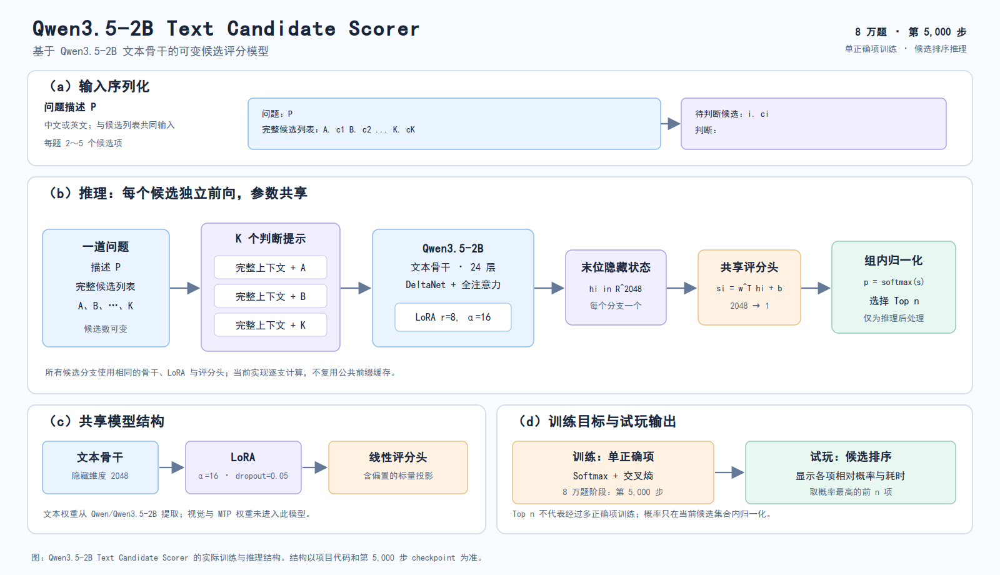
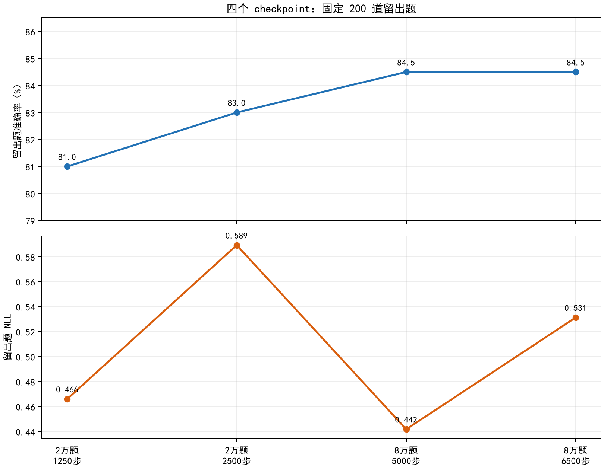

# Qwen3.5-2B Text Candidate Scorer：可变候选评分实验

本仓库实现了一个双语候选项评分模型，受 TypeSafe AI 官方 Jev 的类型化决策接口启发，**与 TypeSafe AI 无关联**。官方 Jev 可回答 Choice、Score、Noul 三类问题；本项目仅实现单正确项候选选择，使用独立的 Qwen3.5 文本骨干、LoRA 和监督训练。官方产品背景、可核实来源及两者差异见[背景说明](docs/Jev背景与本项目关系.md)。

本项目输入包括问题描述和数量可变的候选项，为每个候选项给出分数，并在同一问题内归一化为概率。项目记录了数据整理、Qwen3.5 文本骨干提取、LoRA 训练、checkpoint 恢复、验证集监测以及四个 checkpoint 的同题评测过程。

当前发布对应 **2026-09-25 的实验状态**。8 万题阶段训练到第 6,500 步后暂停。GitHub 仓库提供四个完整 checkpoint，不包含基座权重；[Hugging Face 模型仓库](https://huggingface.co/mx-2026/qwen3.5-2b-text-candidate-scorer)提供可直接下载试玩的文本基座、第 5,000 步 LoRA、评分头和推理脚本。

## 写在前面

这是一个 **100% vibe coding** 的项目，也是我这个几乎从零开始学模型训练的年轻人，第一次把自己的模型真正训练起来的机会。最初我想试试：一张 8GB 的 RTX 4060，能否在还算能接受的天数里训练出一个候选判断模型，并以实用的速度推理？目前本机 4060 已跑通四个 checkpoint 的推理；完整的长程训练借助了中国科学技术大学本科生算力平台（107），所以“只用 4060 完成全部训练需要多久”仍待实测。

从看懂训练流程和 loss，到亲手处理显存、算力、Linux 命令、平台作业和一次又一次 OOM，这次经历让我对 AI 基础设施有了比读资料更直观的认识。感谢官方 Jev 的出现，感谢群友提供最早的思路和架构设计图；感谢 **GPT-6 Sol（High）大人**陪我做架构设计和知识讲解，感谢 **Gemini 3.8 Flash（High）**的高速执行，也感谢 **USTC 本科生算力平台（107）**提供训练所需的高速算力。

接下来想逐步补上更多 Jev 风格的能力，例如多答案选择、无合适选项与更丰富的判断形式；如果算力允许，也想定量研究学习率、批量大小和其他超参数对训练结果的影响。现在的四个 checkpoint 和完整过程先公开，留作这段学习经历的可复核记录。

## A note from the author

This project is **100% vibe coded**. It is also my first real chance to train a model, starting with almost no background in model training. The original question was simple: could an 8 GB RTX 4060 train a candidate decision model in a tolerable number of days and run inference at a useful speed? Inference with all four checkpoints has run on my 4060. The longer training runs used the USTC undergraduate computing platform (107), so a complete 4060 training time is still unmeasured.

Training taught me what the workflow and loss curves actually mean. It also taught me about GPU memory, compute, Linux, shared computing platforms, and more OOM errors than I care to count. Thanks to the arrival of TypeSafe's Jev and to my friends for the first ideas and architecture sketch. Thanks to **GPT-6 Sol (High)** for the architecture work and patient explanations, **Gemini 3.8 Flash (High)** for rapid implementation, and the **USTC undergraduate computing platform (107)** for the GPU time.

Next, I hope to explore more Jev-like capabilities, including multiple valid answers and a “none of the above” option. If compute allows, I also want to measure how learning rate, batch size, and other hyperparameters affect training. For now, these four checkpoints and their training record are here as a reproducible account of my first model-training project.

## 4060 可行性 / RTX 4060 feasibility

**推理已实测。** 在 RTX 4060 Laptop GPU（8 GiB）上，四个 checkpoint 都完成了相同的 200 道留出题，每组耗时 **35.62 至 36.93 秒**，约为每秒 5.4 至 5.6 题。一次加载基座与三个 adapter 的运行显示剩余显存约 3.29 GiB；第 1,250 步模型另行加载评测。推理使用 BF16、最大 1024 token、每批 2 个候选分支。聚合记录见 [`result/analysis/4060_feasibility.json`](result/analysis/4060_feasibility.json)。

**训练有短程证据。** 本机 4060 曾以梯度检查点、每次前向 2 题、每步累积 16 题完成参数更新。短测中成功记录的单步耗时 **23.873 秒**、显存 **4.66 GiB**。只按这一步机械外推，2 万题一轮的 1,250 步约 **8.3 小时**，8 万题一轮的 5,000 步约 **33.2 小时**，两轮 8 万题约 **2.8 天**。这是可行性量级估算，未计入周期性验证、保存、长样本及持续运行的热状态；目前没有在 4060 上完成整轮训练。完整训练实际在 USTC 107 平台进行。数字见 [`4060_feasibility.json`](result/analysis/4060_feasibility.json)。

**Inference has been measured.** On an 8 GiB RTX 4060 Laptop GPU, each of the four checkpoints processed the same 200 held-out questions in **35.62–36.93 seconds**. The run used BF16, a 1,024-token limit, and two candidate branches per forward batch.

**Training has a short smoke result.** With gradient checkpointing, two questions per forward batch, and 16 questions per optimizer step, one successful update took **23.873 seconds** and used **4.66 GiB** of GPU memory. A straight-line calculation gives roughly **8.3 hours** for one 20k-question epoch or **33.2 hours** for one 80k-question epoch. Validation, checkpoint writes, long examples, and sustained thermals can change those numbers. A full 4060 training run has not been measured; the completed long runs used USTC 107 GPUs.


## 最新突破：多模态视觉接回与分支混合缓存极速推理 (2026-09-26)

在纯文本决策模型训练取得良好效果后，项目团队进行了架构与多模态表征的深层探索：

1. **视觉编码器零样本迁移 (0-Shot Multimodal Transfer)**：
   - 将 Qwen3.5 原生视觉编码器（Vision Tower + Projector）重新接回多模态流程。
   - **惊人发现**：在**未经任何多模态决策数据微调**的前提下，纯文本微调出的评分头直接成功识别图像颜色与基础特征，单项决策置信度高达 **94.42%**！
   - **表征机理**：文本微调时未动词表（`embed_tokens` 冻结），基座 Projector 投影的图像 Token 与文本 Token 在第 0 层保持完美的几何对齐；底层自注意力将多模态语义自然注入因果流，使评分头直接具备跨模态判别能力。

2. **混合状态缓存（Hybrid Cache）分支并行优化 (9 倍提速)**：
   - **痛点**：若每个候选分支都重复计算大图像前缀，延迟随选项数线性翻倍。
   - **解法**：基于 Qwen3.5 的混合架构（18 层 Gated DeltaNet + 6 层全注意力 + 卷积历史），实现**两阶段共享混合缓存**：
     - 公共前缀 $P$（图像+问题+候选枚举）仅 Prefill 一次，生成混合缓存 $C_P$；
     - 沿 Batch 维度扩展 $C_P$，所有短分支后缀（约 10~15 tokens）并行走单步 Forward，末位隐状态直接输出所有选项得分。
   - **实测成果**：4 候选分支耗时从 **1730 ms** 骤降至 **191 ms**，**延迟降低 88.9%，加速比达 9.03 倍**，输出余弦相似度达到 **0.998+**。

3. **算力平台多模态兼容训练引擎**：
   - 编写并开源 `jev/train_multimodal_cluster.py`，支持纯文本 JSONL 与多模态图文数据混合训练；
   - 具备完整反传求导、梯度累积、优雅中断与可选视觉投影层微调（`--train-projector`）。

详尽理论分析、与 Sys1MLX / JPT-4B 的全方位横向对比见深度调研报告：[`docs/多模态决策模型与分支混合缓存优化深度调研与架构方案.md`](docs/多模态决策模型与分支混合缓存优化深度调研与架构方案.md)。

## 实际实现



每个候选分支都包含完整候选列表和当前待判断项。训练与本次评测分别计算各分支，当前实现没有复用公共前缀缓存。评分头使用 `nn.Linear(hidden_size, 1)`，包含偏置。LoRA 使用 `r=8`、`alpha=16`、`dropout=0.05`，目标层见 [`jev/train_cluster.py`](jev/train_cluster.py)。该模型用于候选排序与单选判断；checkpoint 的评分头不参与自由文本生成。

## 结果速览

四个 checkpoint 使用相同的 200 道新留出题和 20 道自拟候选题。留出题从 BoolQ、CommonsenseQA、ARC、C3、OCNLI 的原始验证分片抽取，每来源 40 题，并排除了训练集及原有 1,000 题验证集的题目指纹。

| checkpoint | 训练位置 | 新留出题正确数 | 新留出题 NLL | 自拟题正确数 |
|---|---|---:|---:|---:|
| `20k_step1250` | 2 万题，第 1 轮结束 | 162 / 200 | 0.4660 | 14 / 20 |
| `20k_step2500` | 2 万题，第 2 轮结束 | 166 / 200 | 0.5893 | 16 / 20 |
| `80k_step5000` | 8 万题，第 1 轮结束 | **169 / 200** | **0.4418** | **20 / 20** |
| `80k_step6500` | 8 万题，第 2 轮进行中 | **169 / 200** | 0.5313 | **20 / 20** |

第 5,000 与第 6,500 步在新留出题上的正确数相同，后者 NLL 较高。原有 1,000 题验证集也记录了第二轮 NLL 上升。200 题来自训练来源的其他样本，检验同来源新题；20 道自拟题规模小且较简单。完整分组和逐题对照见 [`result/evaluation-2026-09-25/REPORT.md`](result/evaluation-2026-09-25/REPORT.md)。



## 项目结构

```text
.
├── README.md                         项目概览与结果
├── docs/
│   ├── 全流程复现.md                  数据、模型、训练和评测的实际步骤
│   ├── Jev背景与本项目关系.md         官方产品背景与独立实现的边界
│   ├── 模型卡.md                      模型用途、来源与限制
│   └── 发布说明.md                    checkpoint 内容与文件校验
├── datasets/
│   ├── prepare_balanced_20k.py       2 万题训练集及 1,000 题验证集构建
│   ├── prepare_80k.py               8 万题训练集构建
│   ├── audit_downloads.py           原始数据检查
│   └── selected/schema.json         标准化样本格式
├── jev/
│   ├── common.py                     数据校验、提示构造与指标
│   ├── convert_text_model.py         从原始 Qwen 权重提取文本骨干
│   ├── train_cluster.py              本次实际使用的 LoRA 训练脚本
│   ├── play.py                       第 5,000 步模型的交互试玩入口
│   ├── evaluate_zero_shot.py        未微调基座的选项字母基线
│   ├── monitor.py                    训练监测
│   └── requirements.txt             模型运行依赖
├── result/
│   ├── analysis/                     训练与验证曲线、解析 CSV
│   └── evaluation-2026-09-25/       固定留出题、自拟题、评测代码与报告
└── checkpoints/                     四个完整 checkpoint 压缩包
```

GitHub 仓库不包含原始题库、生成后的训练集、独立留出题的逐题文本或裁剪后的基座权重。相应构建脚本保留在仓库，数据需按来源许可自行获取。四个 checkpoint 压缩包包含完整训练恢复状态；推理只需其中的 `adapter/` 和 `score_head.pt`。完整推理包见 [Hugging Face 模型页](https://huggingface.co/mx-2026/qwen3.5-2b-text-candidate-scorer)。

## 交互试玩

从 [Hugging Face](https://huggingface.co/mx-2026/qwen3.5-2b-text-candidate-scorer) 下载完整模型包后，可直接安装依赖并试玩。以下需要 Linux 和 CUDA GPU：

```bash
hf download mx-2026/qwen3.5-2b-text-candidate-scorer \
  --local-dir qwen3.5-2b-text-candidate-scorer
cd qwen3.5-2b-text-candidate-scorer
bash jev/setup_env.sh
jev/.venv/bin/python jev/play.py
```

如果已经在本地准备好文本基座、第 5,000 步 checkpoint 和 `jev/.venv/`，在项目目录运行 `jev/.venv/bin/python jev/play.py` 即可。

依次输入问题和 2 至 5 个候选项。输入完候选项后，在下一项直接回车；随后输入希望选择的项数 `n`，直接回车则默认选择 1 项。脚本会列出各项相对概率、概率最高的前 `n` 项和本题耗时。在“问题”处直接回车退出。也可单次运行：

```bash
jev/.venv/bin/python jev/play.py --question "18 加 27 等于多少？" --top-k 2 \
  --candidate 46 --candidate 45 --candidate 44
```

此入口默认加载 `result/unpacked/epoch-00-step-005000/`。`n` 必须介于 1 与候选项数量之间；多选结果只是候选评分的前 `n` 项排序，模型训练任务仍为单正确项判断。概率仅在当前给出的候选项之间归一化。本题耗时包含分词和推理，不含人工输入与首次模型加载。

## 复现入口

使用 Linux、CUDA GPU 和 Python 3.12。依赖版本见 [`jev/requirements.txt`](jev/requirements.txt)，环境脚本见 [`jev/setup_env.sh`](jev/setup_env.sh)。基座来源为 [Qwen/Qwen3.5-2B](https://huggingface.co/Qwen/Qwen3.5-2B)，本次使用的上游提交为 `15852e8c16360a2fea060d615a32b45270f8a8fc`。下载原始模型后，使用 `jev/convert_text_model.py` 生成 `models/Qwen3.5-2B-Text/`。转换后的权重 SHA-256 记录在 [`docs/发布说明.md`](docs/发布说明.md)。

数据准备、两阶段训练、恢复和四模型评测的可执行命令见 [`docs/全流程复现.md`](docs/全流程复现.md)。下载 checkpoint 后，将每个压缩包解压到 `result/unpacked/`，再运行 `result/evaluation-2026-09-25/evaluate_checkpoints.py`。

## 来源与使用边界

基座模型遵循其上游许可。八个训练数据源具有各自的使用条件，其中 C-Eval 与 CMMLU 的元数据标注了非商业条款。训练过程使用了部分来源名为 `test` 的分片，因此不能把对应官方基准测试分数作为独立泛化结果。公开包不再分发这些原始或转换后的题目。数据来源、切分和结果边界详见 [`docs/模型卡.md`](docs/模型卡.md)。
